# Cisco Intersight Orchestration Sample Veeam Backup & Replication Workflows

## VeeamHub
Veeamhub projects are community driven projects, and are not created by Veeam R&D nor validated by Veeam Q&A. They are maintained by community members which might be or not be Veeam employees. 

## Distributed under MIT license
Copyright (c) 2023 VeeamHub

Permission is hereby granted, free of charge, to any person obtaining a copy of this software and associated documentation files (the "Software"), to deal in the Software without restriction, including without limitation the rights to use, copy, modify, merge, publish, distribute, sublicense, and/or sell copies of the Software, and to permit persons to whom the Software is furnished to do so, subject to the following conditions:

The above copyright notice and this permission notice shall be included in all copies or substantial portions of the Software.

THE SOFTWARE IS PROVIDED "AS IS", WITHOUT WARRANTY OF ANY KIND, EXPRESS OR IMPLIED, INCLUDING BUT NOT LIMITED TO THE WARRANTIES OF MERCHANTABILITY, FITNESS FOR A PARTICULAR PURPOSE AND NONINFRINGEMENT. IN NO EVENT SHALL THE AUTHORS OR COPYRIGHT HOLDERS BE LIABLE FOR ANY CLAIM, DAMAGES OR OTHER LIABILITY, WHETHER IN AN ACTION OF CONTRACT, TORT OR OTHERWISE, ARISING FROM, OUT OF OR IN CONNECTION WITH THE SOFTWARE OR THE USE OR OTHER DEALINGS IN THE SOFTWARE.

## Project Overview
**Author:** Ronn Martin (ronn.martin@veeam.com), Mark Polin (mark.polin@veeam.com)

**Description:** This repository contains sample Powershell-based workflows designed for use with Cisco Intersight Orchestration and Veeam Backup & Replication v11+.

Cisco Intersight Orchestration simplifies orchestration and automation for infrastructure and workloads across hybrid cloud by providing an easy-to-use workflow designer. Based on a library of multi-domain tasks (custom or provided by Cisco), it enables users to create workflows, quickly and easily.  This enables automation and deployment of any infrastructure resource, including servers, VMs, networks and applications.  Customer’s benefit from Intersight Orchestration by reducing the complexity of managing their hybrid IT environment.

## 📗 Project Notes

Prerequisites: 
* Veeam Backup & Replication (VBR) server instance(s), v11+
* Cisco Intersight Assist - on-premises Cisco server which enables visibility of datacenter endpoint devices for the Cisco Intersight Orchestration cloud-based service. Cisco Intersight Assist is available as a virtual appliance (OVA) for installation on VMware ESXi. For more information, see the [Cisco Intersight Virtual Appliance Getting Started Guide](https://www.cisco.com/c/en/us/td/docs/unified_computing/Intersight/cisco-intersight-assist-getting-started-guide/m-overview-of-cisco-intersight-assist.html). Virtual appliance installation steps can be found at [Installing Cisco Intersight using VMware vSphere Web Client](https://www.cisco.com/c/en/us/td/docs/unified_computing/Intersight/cisco-intersight-assist-getting-started-guide/m-installing-cisco-intersight-assist.html) DO NOT ignore the DNS setup steps.

Setup: 
* Once Cisco Intersight Assist has been deployed and configured it can be by claimed by the Intersight cloud service per the procedure documented at - [Target Claim for Compute/Fabric, Hyperconverged, Orchestrator, and Platform Services Targets](https://www.intersight.com/help/saas/getting_started/claim_targets#minimum_permissions_for_targets).  
* Next, VBR server(s) need to be "claimed" as authorized targets for PowerShell "executor" orchestration access. Prepare the target VBR instance(s) by copying and executing the PowerShell script located at [Executors - Invoke PowerShell Script](https://intersight.com/help/saas/resources/Executor_PowerShell#supported_targets) to grant the necessary WinRM remoting permissions. 
* VBR server(s) can then be claimed via the procedure outlined at [Target Claim Using Intersight Assist](https://intersight.com/help/saas/getting_started/claim_targets#target_claim_using_intersight_assist)
* Sample workflows are located in the "Sample Workflows" folder of this repository and should be downloaded and imported via the Intersight web console.  Note that orchestration workflow tasks are embedded in the workflows and will also populate new Intersight tasks concurrent with the workflow import. Two workflows are provided for reference -
  * **VBR - Deploy Agents:** Takes inputs of target VBR server, IP addresses or DNS names for agent targets, agent target credentials (one set), OS platform (Windows or Linux), protection group name, protection group description, backup job name and VBR repository name.  This workflow checks for the existence of the agent credentials in the VBR database and adds them if they do not exist, next creates the protection group and adds the specified agent targets and finally creates a backup job for the protection group.
  * **VBR - Deploy Proxy:** Takes inputs of target VBR server, IP address or DNS name for targeted proxy host, target proxy host credentials, OS platform (Windows or Linux) and the proxy type to deploy (VMware, Hyper-V, CDP, NAS, etc.).  This workflow checks for the existence of the agent crendentials in the VBR database and adds them if they do not exist, adds the targeted host as a VBR managed server and finally assigns the appropriate proxy role to the server.

Operation:
* **Modify an existing workflow - The sample workflows should operate correctly without modification but of course only address two narrow use cases.  The orchestration tasks which are populated with the workflow import can be freely modified or new tasks may be created from scratch. For illustrative purposes, to extend the "VBR Add Managed Server v1.0" task to also allow vCenter host additions the "VBR - Add Managed Server v1.0" task attached Powershell script could be updated from -
  * ```
            Switch ({{.global.task.input.hostplatform}}) {
                0 {
                    Write-Output "Adding windows host"
                    Add-VBRWinServer -Name "{{.global.task.input.servername}}" -Credentials $cred
                    }
                1 {        
                    Write-Output "Adding linux host"
                    Add-VBRLinux -Name "{{.global.task.input.servername}}" -Credentials $cred -confirm:$False
                    }
            }
  ```

* to -

   * ```
            Switch ({{.global.task.input.hostplatform}}) {
                0 {
                    Write-Output "Adding windows host"
                    Add-VBRWinServer -Name "{{.global.task.input.servername}}" -Credentials $cred
                    }
                1 {        
                    Write-Output "Adding linux host"
                    Add-VBRLinux -Name "{{.global.task.input.servername}}" -Credentials $cred -confirm:$False
                    }
                2 {        
                    Write-Output "Adding VMware host"
                    Add-VBRvCenter -Name "{{.global.task.input.servername}}" -Credentials $cred
                    }
            }
  ```
Via selecting the Powershell executor task step, properties, inputs and script -

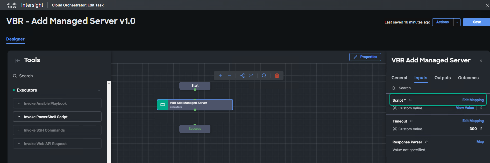

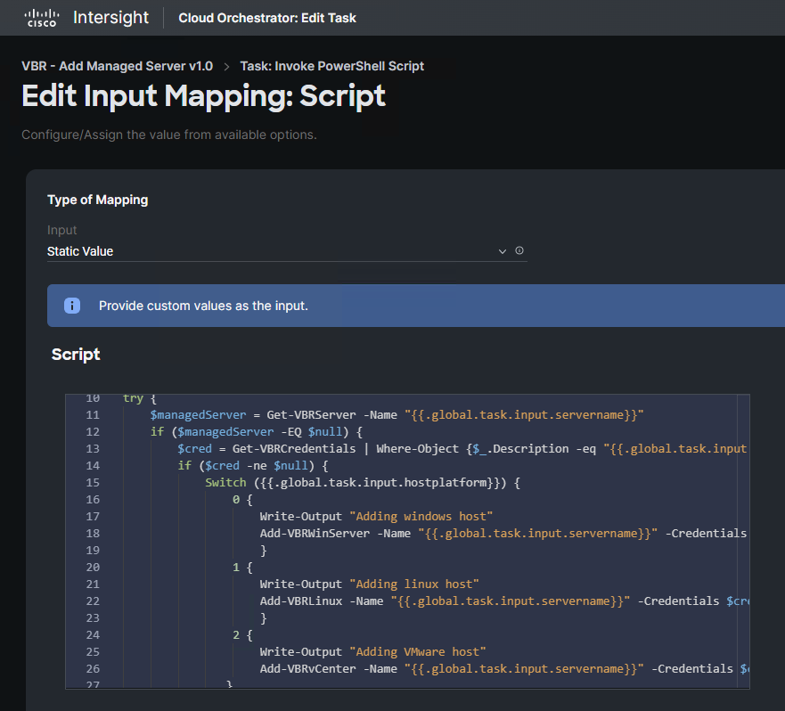

Next since an enumeration type is defined for the managed server OS platform in our example the task properties must be extended to include the new vCenter type matching the modiefied Powershell script via -

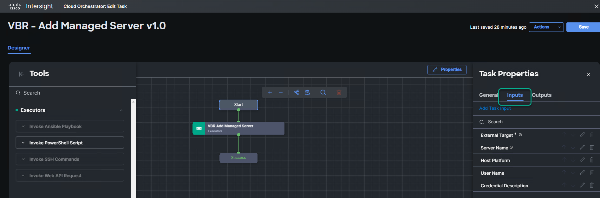

Select the edit icon for the "Host Platform" input and add an entry for vCenter-

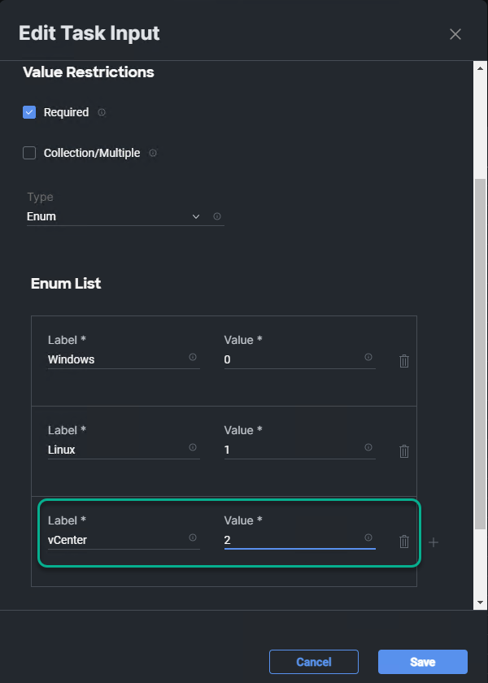

Finally modify the workflow(s) leveraging the add managed server task to reflect the added platform enumeration type by selecting the workflow input mapped to the server OS platform (in this case "Host Platform") -

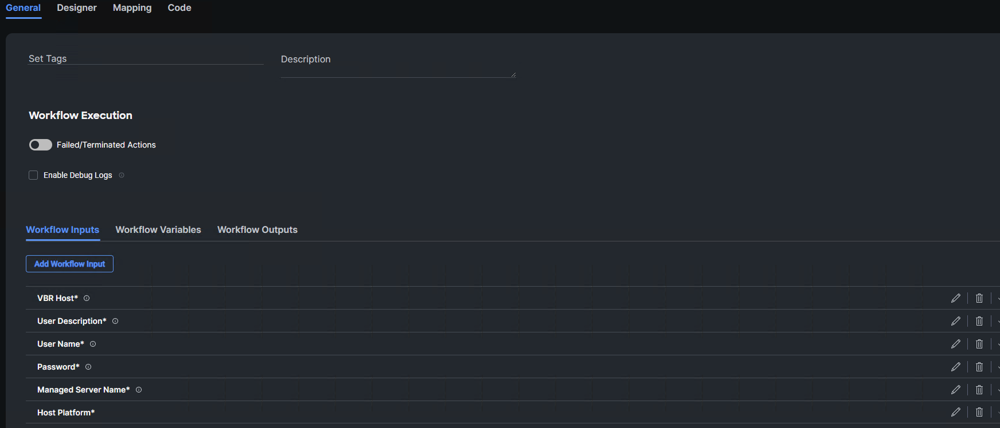

And add the new enumeration type for vCenter -

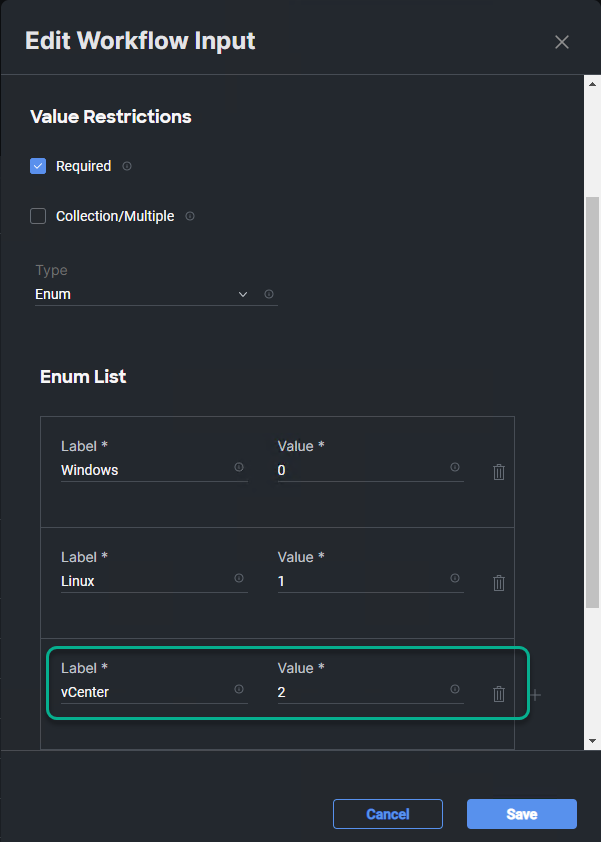


* Creating a custom workflow - To create a custom workflow from existing tasks simply select "Create Workflow" from the workflows space -

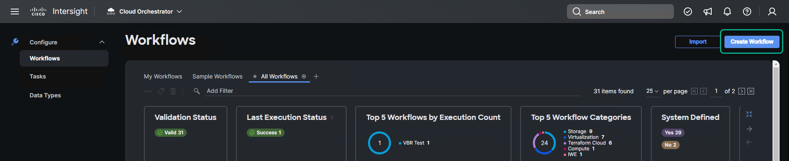

  * Name the workflow and then select the "Designer" tab.  Add and choose execution order for required tasks by dragging and dropping from the task palette -

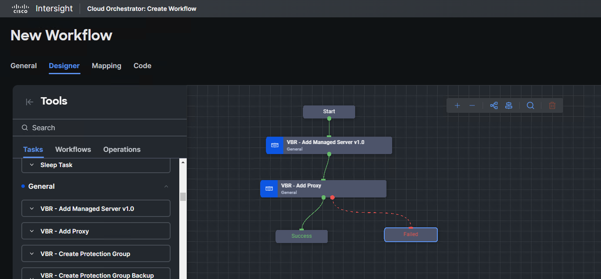

  * For each task input, create or select a mapping to a workflow input

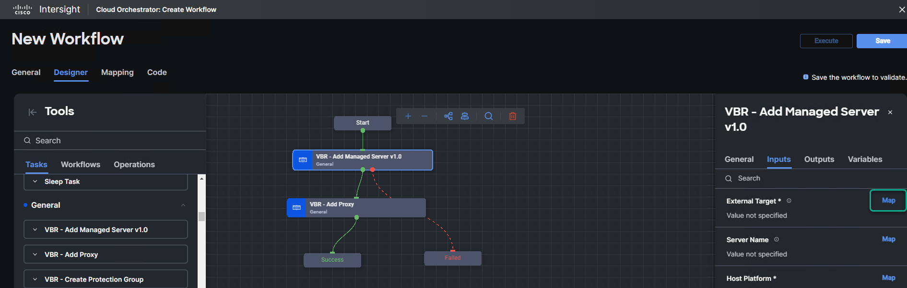

  * Static (hardcoded) inputs can be established by selecting "Map" and "Static Value" which is set at workflow design time -

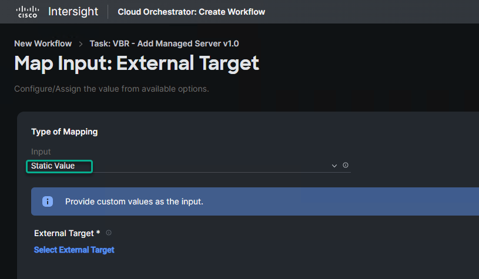

  * Dynamic (user prompt at workflow runtime) inputs can be defined via "Direct Mapping". In the case below no workflow inputs have yet been defined so "Add Workflow Input" is selected -

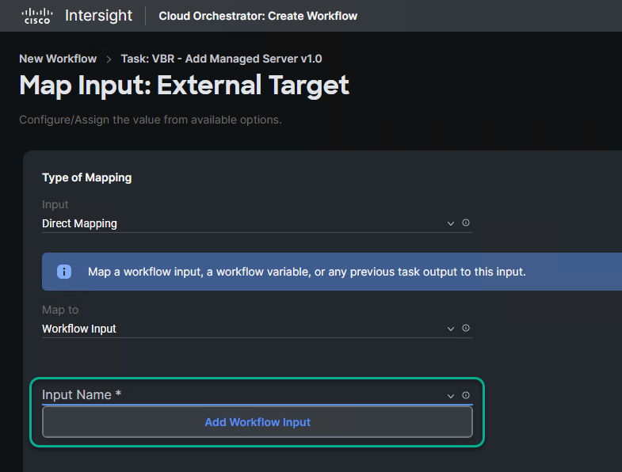

  * By default the new workflow input will inherit the same name, reference name, description and type defined in the underlying task input.  All these may be modified for the workflow save for type which has to match the task defined type.

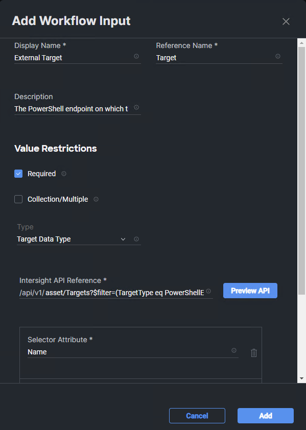

## ✍ Contributions

We welcome contributions from the community! We encourage you to create [issues](https://github.com/VeeamHub/veeam-cisco-intersight-workflows/issues/new/choose) for Bugs & Feature Requests and submit Pull Requests. For more detailed information, refer to our [Contributing Guide](CONTRIBUTING.md).

## 🤝🏾 License

* [MIT License](LICENSE)

## 🤔 Questions

If you have any questions or something is unclear, please don't hesitate to [create an issue](https://github.com/VeeamHub/veeam-cisco-intersight-workflows/issues/new/choose) and let us know!
